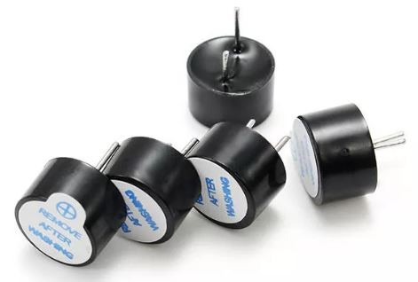
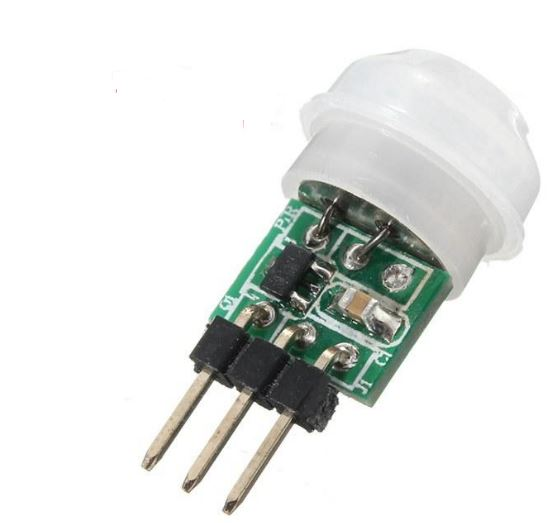
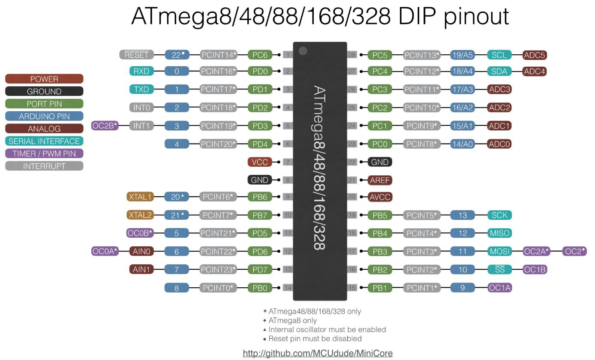
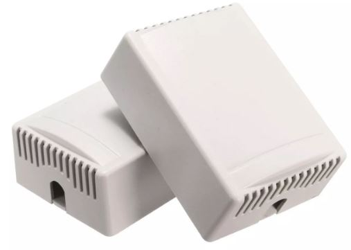

# 166 ATMega328P Deep Sleep Project Update
An update to the Deep Sleep Airing Cupboard project, now also a fridge alarm!

## See https://www.youtube.com/ralphbacon video #165
### (Direct link to video: https://youtu.be/BuxgEeq9IBU)

### $5 for 10 PCBs https://www.pcbway.com  
PCB Prototype the Easy Way  
Full feature custom PCB prototype service  
```
First order free! 2-sided PCB just $5 for 10 pieces. Assembly for 20-pieces just $30.
PCB Prototyping the easy way - see my video #129 for Hands-On details.

Why Buy Your Printed Circuit Boards From PCBWay?  
  * Prototype Fab with 24 hours Express  
  * Team supported with over 50 professionals & technical  
  * 99% on-Time Shipping with great support from DHL  
  * Great quality approved by customers all over the world  
  * Trusted Experience  
  * 24 Hour Non-stop Tech Support and Production  
  * Low Minimums  
  * Factory Outlet PCBs with most competitive advantages  
  * Chief PCB Manufacturer Located in China 
```

So my movement alarm in a dark place is complete - and also turned into a light activated alarm too. Thanks to the low power used (due to Deep Sleep) the batteries on both projects should last for at least 1 year.

The PCB in this project, made by PCBWay.com, was panelised, meaning the PCBs were joined together. This is essential when creating boards for SMD assembly but otherwise it's actually cheaper to have them made singly.

### LINKS
My PCB design can be found here:  
https://www.pcbway.com/project/shareproject/PIR_Deep_Sleep_for_ATMega328P.html

CoolTerm - a great alternative to PUTTY. Freeware but he accepts donations. Yes, I donated $10. It's worth it.
https://freeware.the-meiers.org/

The sketches are in the GitHub. Amend to suit your needs!

Small **beeper**: 5 PCS Super Loud 5V Active Alarm Buzzer Beeper Tracker 9\*5.5mm
https://www.banggood.com/5-PCS-Super-Loud-5V-Active-Alarm-Buzzer-Beeper-Tracker-95_5mm-for-Racing-Drone-p-1117207.html?p=FQ040729393382015118&utm_campaign=25129675&utm_content=3897  

Small **PIR module** (5 pieces you can buy singly or in threes too)  
https://www.banggood.com/5Pcs-Mini-IR-Infrared-Pyroelectric-PIR-Body-Motion-Human-Sensor-Detector-Module-p-1020426.html?p=FQ040729393382015118&utm_campaign=25129675&utm_content=3897

ATMega328P pin out (Arduino vs Physical Pins etc)  
https://camo.githubusercontent.com/c55beef2f138da61fe671a1e4a307ff4ffbc318d/68747470733a2f2f692e696d6775722e636f6d2f715849456368542e6a7067

Plastic case used in this project  
https://www.banggood.com/2pcs-75-x-54-x-27mm-DIY-Plastic-Project-Housing-Electronic-Junction-Case-Power-Supply-Box-p-1063302.html?p=FQ040729393382015118&utm_campaign=25129675&utm_content=3897

If you like this video please give it a thumbs up, share it and if you're not already subscribed please consider doing so and joining me on my Arduinite journey

My channel and blog are here:  
\------------------------------------------------------------------  
https://www.youtube.com/RalphBacon  
https://ralphbacon.blog  
\------------------------------------------------------------------
